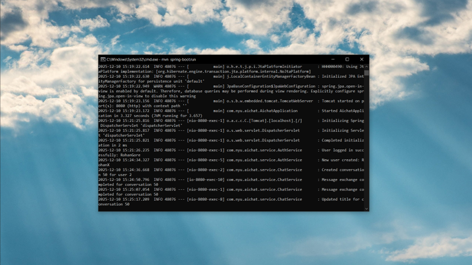
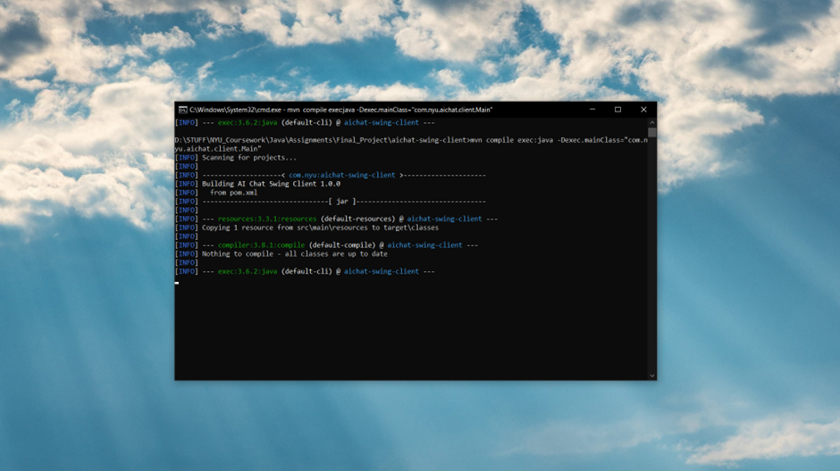
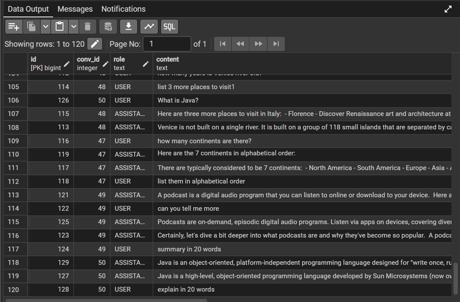
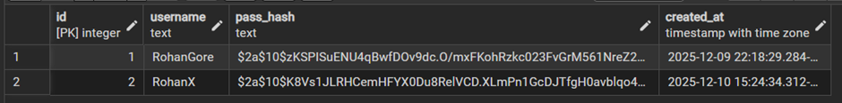
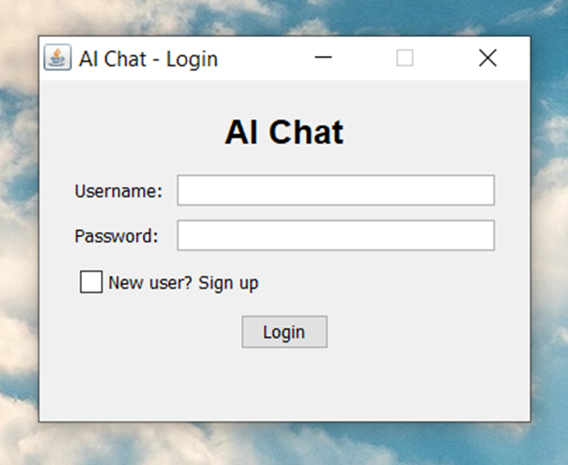
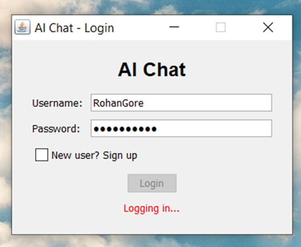
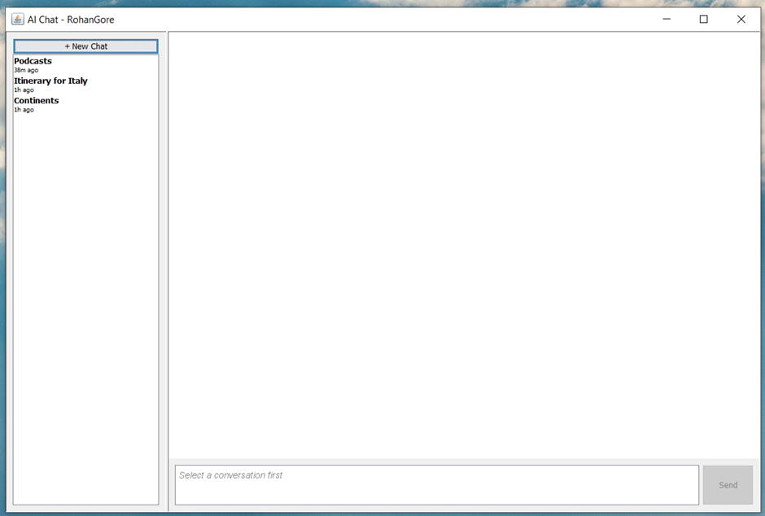
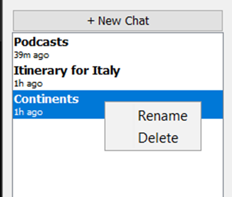
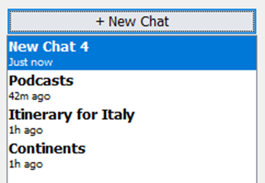
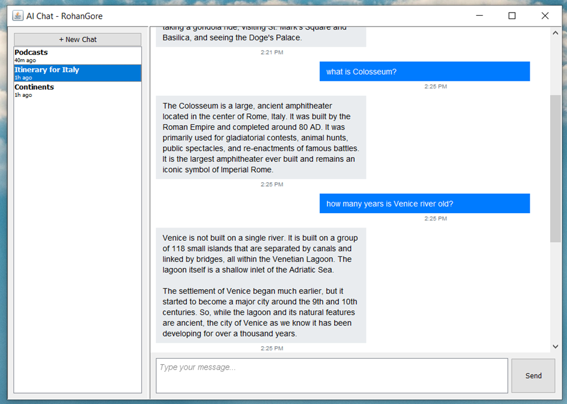

# AI Chat Desktop Application

> **Project Status:** ✅ Fully Implemented
> **Last Updated:** December 10, 2025

A Java-based desktop application that enables users to chat with an AI assistant (Google Gemini) through a modern Swing interface, backed by a Spring Boot REST API and PostgreSQL database.

---

## Table of Contents

1. [Overview](#overview)
2. [Architecture](#architecture)
3. [Technology Stack](#technology-stack)
4. [Key Components](#key-components)
5. [Database Schema](#database-schema)
6. [API Endpoints](#api-endpoints)
7. [Advanced Java Concepts](#advanced-java-concepts)
8. [User Interface](#user-interface)
9. [How to Run](#how-to-run)

---

## Overview

### Features

- **User Authentication**: Secure signup/login with BCrypt password hashing
- **Multi-Conversation Management**: Create, rename, and delete chat threads
- **AI Chat Integration**: Google Gemini API with context-aware responses (6-message history)
- **Persistent Storage**: PostgreSQL database with linked-list message structure
- **Desktop GUI**: Java Swing client with responsive UI
- **Multithreading**: Background API calls with Event Dispatch Thread (EDT) for UI updates

### Project Structure

```
Final_Project/
├── aichat-backend/          # Spring Boot REST API
├── aichat-swing-client/      # Java Swing Desktop Client
└── docs/                     # Documentation
```

---

## Architecture

### High-Level Architecture

The application follows a **client-server architecture** with three main layers:

1. **Swing Client** (Desktop Application)

   - LoginFrame: User authentication UI
   - MainChatFrame: Main chat interface with sidebar and message panel
   - ApiClient: HTTP client for backend communication
2. **Spring Boot Backend** (REST API)

   - Controllers: Handle HTTP requests (AuthController, ChatController)
   - Services: Business logic (AuthService, ChatService, GeminiService)
   - Repositories: Data access layer (Spring Data JPA)
3. **PostgreSQL Database**

   - Stores users, conversations, and messages
   - Messages use linked-list structure for data integrity
4. **External Integration**

   - Google Gemini API (gemini-2.5-flash model) for AI responses

### Communication Flow

```
Swing Client → HTTP/REST (JSON) → Spring Boot Backend → JPA/JDBC → PostgreSQL
                                                      → HTTPS → Gemini API
```

---

## Technology Stack

### Backend

- **Java 1.8**: Core language
- **Spring Boot 2.7.18**: REST API framework
- **Spring Data JPA**: Database ORM
- **PostgreSQL**: Relational database
- **BCrypt**: Password hashing (Spring Security)
- **Jackson**: JSON processing

### Frontend

- **Java 1.8**: Core language
- **Java Swing**: Desktop GUI framework
- **Gson 2.10.1**: JSON parsing
- **HttpURLConnection**: HTTP client (JDK built-in)

### Build Tools

- **Maven 3.x**: Dependency management and build automation

---

## Key Components

### Backend Components



**Controllers**

- `AuthController`: Handles `/api/v1/auth/signup` and `/api/v1/auth/login` endpoints
- `ChatController`: Manages conversation and message endpoints
- `GlobalExceptionHandler`: Centralized error handling with `@ControllerAdvice`

**Services**

- `AuthService`: User signup and login with BCrypt password verification
- `ChatService`: Conversation CRUD operations, message management, linked-list maintenance
- `GeminiService`: Google Gemini API integration with context building and response cleaning

**Repositories**

- `UserRepository`: User data access with custom queries
- `ConversationRepository`: Conversation queries with soft-delete filtering
- `MessageRepository`: Message queries with timestamp ordering

**Entities**

- `User`: Maps to `app_user` table
- `Conversation`: Maps to `conversation` table with linked-list pointers
- `Message`: Maps to `message` table with `prev_message_id` and `next_message_id`

### Frontend Components



**UI Components**

- `LoginFrame`: Login/signup window with form validation
- `MainChatFrame`: Main window with JSplitPane layout (sidebar + chat area)
- `ConversationPanel`: Left sidebar displaying conversation list with context menu
- `MessagePanel`: Scrollable message display area
- `MessageBubble`: Individual message component (user: blue/right, assistant: gray/left)
- `InputPanel`: Text input with Enter key handling and placeholder support

**API Layer**

- `ApiClient`: HTTP client wrapper for all backend endpoints
- `ApiException`: Custom exception for API errors

**Models**

- `UserSession`: Immutable session data (userId + username)
- `ConversationView`: Conversation display model with formatted dates
- `MessageView`: Message display model with formatted timestamps

---

## Database Schema

### Tables

**app_user**

- `id`: Primary key (SERIAL)
- `username`: Unique, 3-20 characters (alphanumeric + underscore)
- `pass_hash`: BCrypt hashed password
- `created_at`: Account creation timestamp

**conversation**

- `id`: Primary key (SERIAL)
- `user_id`: Foreign key to `app_user`
- `title`: Chat title (max 200 chars, defaults to "New Chat 1", "New Chat 2", etc.)
- `created_at`: Creation timestamp
- `head_message_id`: First message in linked list
- `last_message_id`: Last message in linked list
- `is_deleted`: Soft delete flag (BOOLEAN)

**message**

- `id`: Primary key (BIGSERIAL)
- `conv_id`: Foreign key to `conversation`
- `role`: Message sender (USER or ASSISTANT, uppercase)
- `content`: Message text (1-4000 characters)
- `ts`: Timestamp (TIMESTAMPTZ)
- `prev_message_id`: Previous message in linked list
- `next_message_id`: Next message in linked list

### Linked-List Structure



Messages are stored as a doubly-linked list within each conversation:

- Each message has `prev_message_id` and `next_message_id` pointers
- Conversation maintains `head_message_id` (first message) and `last_message_id` (most recent)
- Messages are retrieved ordered by timestamp for UI display, but linked-list structure ensures data integrity

---

## API Endpoints

### Authentication

- **POST `/api/v1/auth/signup`**: Create new user account

  - Request: `{username, password}`
  - Response: `{userId, username}`
- **POST `/api/v1/auth/login`**: Authenticate user

  - Request: `{username, password}`
  - Response: `{userId, username}`

### Conversations

- **POST `/api/v1/conversations`**: Create new conversation

  - Headers: `X-User-Id`
  - Request: `{title}` (optional, defaults to serial numbering)
  - Response: `{id, title, createdAt}`
- **GET `/api/v1/conversations`**: List user's conversations

  - Headers: `X-User-Id`
  - Response: Array of conversations (ordered by `createdAt DESC`)
- **GET `/api/v1/conversations/{id}/messages`**: Get conversation messages

  - Headers: `X-User-Id`
  - Response: Array of messages (ordered by timestamp ASC)
- **POST `/api/v1/conversations/{id}/messages`**: Send message and get AI reply

  - Headers: `X-User-Id`
  - Request: `{text}`
  - Response: `{assistantMessage: {id, role, content, ts}}`
- **PUT `/api/v1/conversations/{id}/title`**: Rename conversation

  - Headers: `X-User-Id`
  - Request: `{title}`

- **DELETE `/api/v1/conversations/{id}`**: Soft delete conversation
    - Headers: X-User-Id: 1
    - Response (200): Empty body (soft delete)

---

## Advanced Java Concepts

### 1. GUI Programming (Java Swing)
- **Components**: JFrame, JPanel, JSplitPane, JList, JScrollPane, JTextArea, JButton
- **Layout Managers**: GridBagLayout, BorderLayout, BoxLayout, FlowLayout
- **Custom Components**: PlaceholderTextArea, MessageBubble, ConversationListCellRenderer
- **Event Handling**: ActionListeners, MouseListeners, KeyListeners

### 2. Database & JDBC
- **Spring Data JPA**: Repository pattern with custom query methods
- **Entity Relationships**: @ManyToOne, @OneToMany annotations
- **Transaction Management**: @Transactional for atomic operations
- **Custom Queries**: Native SQL and JPQL for complex operations

### 3. Spring Framework
- **Dependency Injection**: @Autowired, @Service, @Repository, @Component
- **REST Controllers**: @RestController, @RequestMapping, @PostMapping, @GetMapping
- **Request Handling**: @RequestBody, @PathVariable, @RequestHeader, @Valid
- **Error Handling**: @ControllerAdvice, @ExceptionHandler

### 4. Multithreading
- **ExecutorService**: Background thread pool for API calls
- **Event Dispatch Thread (EDT)**: SwingUtilities.invokeLater() for UI updates
- **Thread Safety**: Separation of background operations and UI updates
- **Optimistic Updates**: User messages displayed immediately before server confirmation

### 5. Networking
- **HTTP Client**: HttpURLConnection for REST API calls
- **JSON Processing**: Gson for serialization/deserialization
- **Custom Headers**: X-User-Id for authentication
- **External API Integration**: Google Gemini API with timeout handling

### 6. Security



- **Password Hashing**: BCrypt with automatic salt generation
- **Authentication**: Header-based (X-User-Id) with ownership validation
- **Input Validation**: Username patterns, password length, message size limits

---

## User Interface

### Login Screen





The login screen provides a simple interface for user authentication. Users can toggle between login and signup modes, enter their credentials, and receive immediate feedback on validation errors.

### Chat Window



The main chat interface features a split-pane layout with a conversation sidebar on the left and the message area on the right. User messages appear on the right with blue backgrounds, while AI responses appear on the left with gray backgrounds.

### Conversation Management





Users can right-click on any conversation in the sidebar to access context menu options for renaming or deleting. New conversations are automatically numbered (New Chat 1, New Chat 2, etc.) if no custom title is provided.

### AI Context and Responses



The AI maintains context across messages by using the last 6 messages from the conversation history. This allows for coherent, context-aware responses that understand the flow of the conversation.

---

## How to Run

### Prerequisites

- **JDK 1.8** or higher
- **Maven 3.x**
- **PostgreSQL** (installed and running)
- **Google Gemini API Key**

### Setup Steps

1. **Database Setup**
   ```bash
   createdb ai_chat
   psql ai_chat < aichat-backend/src/main/resources/db/schema.sql
```

2. **Configure Backend**

   - Edit `aichat-backend/src/main/resources/application.properties`
   - Set PostgreSQL password: `spring.datasource.password=your_password`
   - Set Gemini API key: `gemini.api.key=your_api_key`
3. **Start Backend**

   ```bash
   cd aichat-backend
   mvn spring-boot:run
   ```

   Backend runs at `http://localhost:8080`
4. **Start Client**

   ```bash
   cd aichat-swing-client
   mvn compile exec:java -Dexec.mainClass="com.nyu.aichat.client.Main"
   ```

   Or build and run JAR:

   ```bash
   mvn clean package
   java -jar target/aichat-swing-client-1.0.0.jar
   ```

### Configuration

**Backend** (`application.properties`):

- Server port: `8080`
- Database connection settings
- Gemini API key

**Client** (`config.properties`):

- API base URL: `http://localhost:8080/api/v1`
- API timeout: `30000ms`
- UI window dimensions

---

## Documentation

For detailed documentation, see:

- `docs/LLD.md`: Low-Level Design document with detailed architecture
- `docs/SUBMISSION.md`: Submission document for professor
- `aichat-backend/README.md`: Backend-specific setup and API details
- `aichat-swing-client/README.md`: Client-specific setup and usage

---

GG.